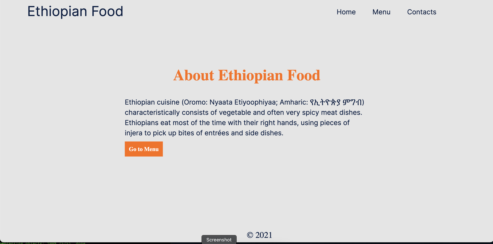
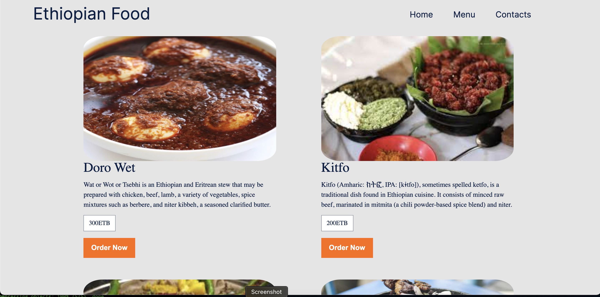
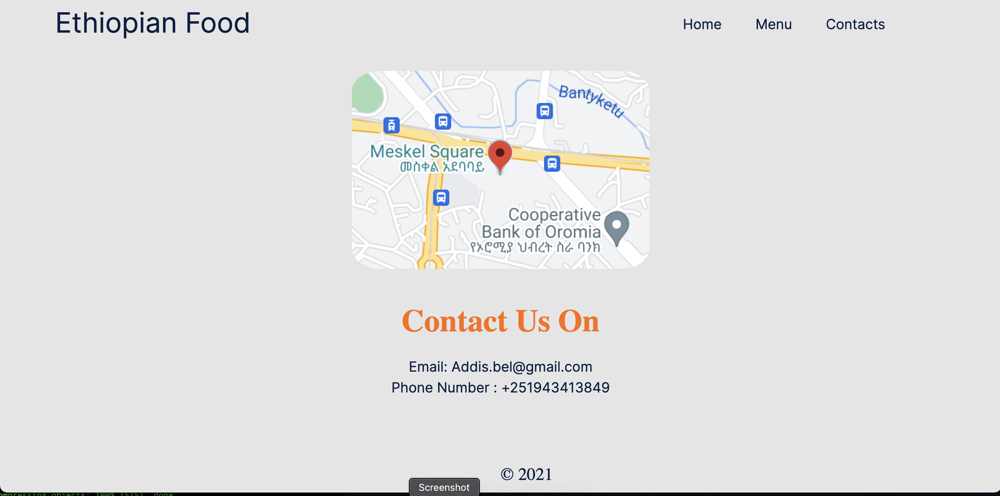

# Restaraunt Page

> In this project, I built a basic restaurant page using JavaScript and webpack. All pages are build using DOM manipulations.





Additional description about the project and its features.

## Built With

- JavaScript
- Webpack
- Css

## Live Demo

[Live Demo Link](https://addis0943.github.io/Restaurant/)

## Prerequisites

```
Web Browser
```

## Install

```
$ npm install --save-dev webpack

```

## Getting Started

## To get local copy up and running follow these simple example steps

```
git clone git@github.com:Addis0943/Restaurant.git
```

```
cd Restaurant
```

### Linters.

Install some dependencies by running the following command

```
npm install --save-dev eslint@7.x eslint-config-airbnb-base@14.x eslint-plugin-import@2.x babel-eslint@10.x
```

```
npm install --save-dev stylelint@13.3.x stylelint-scss@3.17.x stylelint-config-standard@20.0.x stylelint-csstree-validator
```

Run the following command to check linters

```
npx eslint .
```

```
npx stylelint "\*_/_.{css,scss}"
```

### Deployment

```
Install and run a live server plugin on your Text editor.
```

👤 **Addis Belete**

- GitHub: [@Addis0943](https://github.com/Addis0943)
- Twitter: [@Addis32018084](https://twitter.com/Addis32018084)
- LinkedIn: [LinkedIn](https://www.linkedin.com/in/addis-belete-134b98191/)

## 🤝 Contributing

Contributions, issues, and feature requests are welcome!

Feel free to check the [issues page](../../issues/).

## Show your support

Give a ⭐️ if you like this project!

## Acknowledgments

- Hat tip to anyone whose code was used
- Inspiration
- etc

## 📝 License

This project is [MIT](./MIT.md) licensed.
